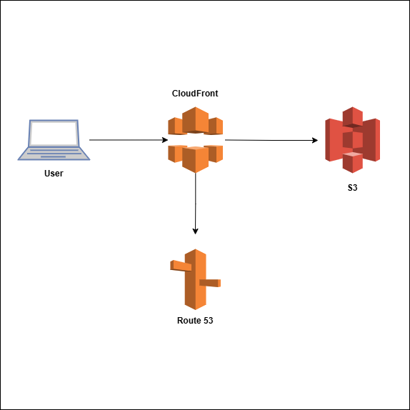

# Word Counter

Word Counter is a basic app that counts the number of words in a content. The content can either be pasted or uploaded as a file.

The essence of this project is to also illustrate the hosting of the application using CloudFront, Route 53, and S3 bucket.



## OBJECTIVE:
- Host a static website on S3, enable public access & configure S3 for website hosting
- Set up CloudFront for faster content delive
- Configure Route 53 for a custom domain
- Use an SSL certificate for HTTPS

## STEPS:

1. **Create an S3 Bucket for your Static Website Hosting**
    - Go to your AWS S3 console
    - Click create Bucket then name it a matching name for your domain (e.g., yourdomain.com) and uncheck all public access
    - Go to properties tab and select Static Web Hosting
    - Enable Host a Static Website [index & error document] - index.html, error.html
    - Upload the website files - index.html, script.js, style.css, flowchart.png

    **To Set up Bucket Policy**
    - Locate Permissions tab and select Bucket Policy
    - Add the policy below and click save to allow public read access to the website:
    ```json
    {
        "Version": "2012-10-17",
        "Statement": [
            {
                "Effect": "Allow",
                "Principal": "*",
                "Action": "s3:GetObject",
                "Resource": "arn:aws:s3:::your-domain.com/*"
            }
        ]
    }
    ```
2. **Create a CloudFront Distribution**
    - Go to your AWS CloudFront console
    - Click create Distribution
    - Select S3 Bucket and choose Origin Access Control
    - Redirect HTTP to HTTPs
    - Enable Compress Objects Automatically then click create Distribution

3. **Configure Custom Domain in Route 53**
    - Go to AWS Route 53 and navigate to Hosted Zones
    - Click on domain name
    - Create Alias Record : [Name : yourdomain.com, Type: Alias (A), Value: CloudFront distribution URL

4. **Enable SSL with AWS Certificate Manager (ACM)**
    - Go to your AWS S3 Certificate Manager
    - Request a Public SSL Certificate [enter your domain, choose DNS Validation, Add the CNAME to Route 53]
    - Attach the certificate to your CloudFront Distribution


**NB - revisit cloud front when done with steps above
    * select the cloudfront distribution > under general click edit > under alternate domain name (CNAME), enter yourdomainname.com then save

